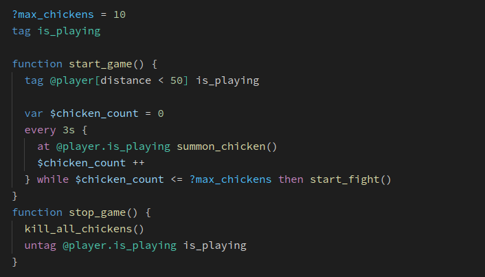

# Minity
> A scripting language for Vanilla Minecraft

## What it is

Minity is a scripting language which compiles to Vanilla Minecraft datapacks. It will allow you to develop complex datapacks in just a few files, and make your work easier by providing intuitive syntax for using some of the most powerful, but also hardest to use, Minecraft commands.

For some examples of what minity can do, see [Features](/features). To get started, see [Quick start](/getting-started). 

Also check out [the examples](https://github.com/minity-script/minity/tree/main/examples) and [full syntax docs](syntax/basics.md). There is also [a vscode extension](https://marketplace.visualstudio.com/items?itemName=minity.minity) available.

## Minity in action
Here's a demo video for Colored Keys, one of the included examples in Minity. Click below to watch the video, and check out [the source code of this datapack](https://github.com/minity-script/minity/blob/main/examples/colored_keys/src/index.minity).

## Support the project

- <b>Want to help?</b> Star us [on github](https://github.com/minity-script/minity), try out [the examples](https://github.com/minity-script/minity/tree/main/examples), share any that you create, [report issues](https://github.com/minity-script/minity/issues) on GitHub, and/or [support us on Patreon](https://www.patreon.com/minity).
- <b>Have questions?</b> Join our [discord server](https://discord.gg/DnY7nDzdzm).
